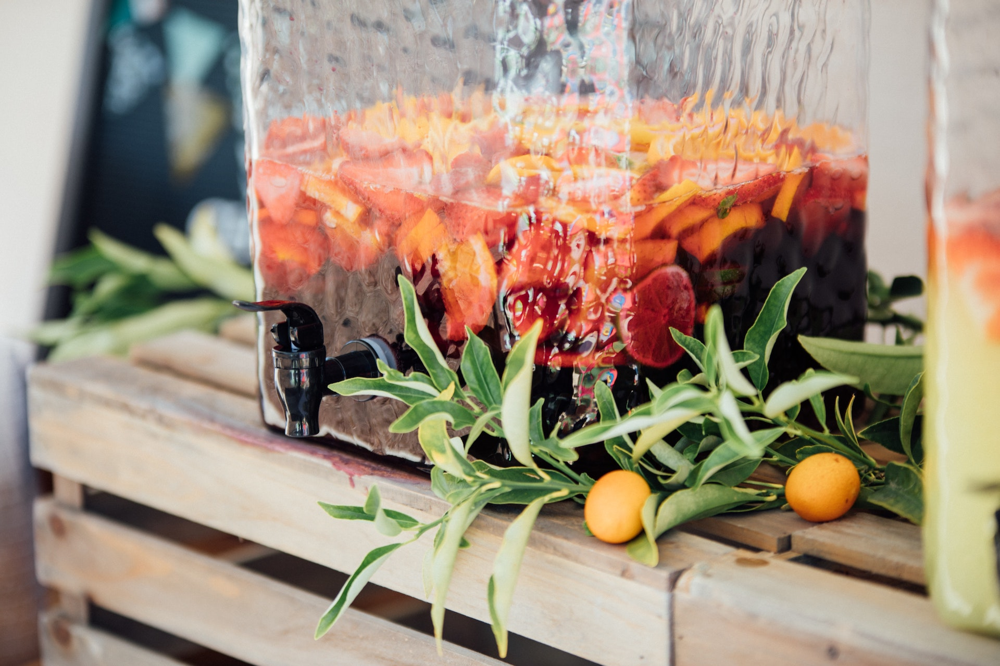

Sangria taitaa olla tunnetuin espanjalainen juoma, -aina kun saan vieraita suomesta, ja varsinkin jos matka on heille ensikosketus espanjaan, he haluavat maistaa sangriaa. Paras paikka juoda sangriaa on tietysti jossain mukavalla terassilla, auringon paisteessa; mutta tottahan toki sangriaa voi tehdä myös kotona, ja siitä tulee vähintäänkin yhtä hyvää kuin tavernoissa. Tässä oikea, ja ehkä paras sangria ohje, mitä voit löytää!

Sangrian nimi tulee juoman verenpunaisesta väristä, -sen takia sangria tehdäänkin punaviinistä, eikä valkoviinistä. Sangriaa voi kuitenkin tehdä myös vaihtamalla punaviinin Cava kuohuviiniin, silloin kyseessä on "Sangria de Cava".
Usein sangriaan lisätään vahvenmpaa alkoholia, -se ei kuitenkaan ole missään nimessä pakollista, vaan täysin vapaaehtoista.

## Sangriaan tekemiseen tarvitset nämä:

- Pullo punaviiniä (ei tarvitse olla parasta mahdollista, lähes kaikki käy)
- Kaksi persikkaa
- Kaksi appelsiinia
- Yksi sitruuna
- Kaksi banaania
- Yksi omena
- 60g sokeria
- kanelitanko
- pikkupullo (330ml) appelsiini limonaadia (esim Jaffaa tai Fantaa)
- Jos sangriasta haluaa hiukan tujumpaa, sekaan voi kaataa lorauksen brandya, konjakkia tai muuta väkevää

## Sangrian teko-ohje
Aloita ottamalla esille noin 60 grammaa sokeria. Sekoita sokeri vajaaseen desilitraan lämmintä vettä (tämä auttaa sokerin sekoittumisessa ja liukenemisessa).

Käytä boolimaljaa tai isoa kannua ja sekoita vesi-sokeri-liuos sekä punaviini. Leikkaa appelsiinit puoliksi, ja purista käsin appelsiinien mehut sekaan. Sekoita hyvin.

Kuori kaikki hedelmät (paitsi appelsiinit sekä sitruunat!), leikkaa ne pieniksi paloiksi ja lisää ne boolimaljaan/kannuun. Leikkaa appelsiinit joko lohkoiksi tai siivuiksi ja lisää nekin sekaan. Purista sitruunasta käsin mehut sekaan, ja heitä sitruunankuoret roskiin. Lisää joukkoon kanelintanko. Anna hedelmien hautua 2-3 tunnin ajan huoneenlämmössä.

Kun pari tuntia on kulunut, sangria on periaattessa valmista. Jos sinulla on isot bileet tulossa, voit tehdä etukäteen usean kannullisen valmiiksi. Ennen kuin sangria tarjoillaan, lisätään vain jääpalat sekä Jaffa tai Fanta. Sangriakannun voi myös koristella vaikka appelsiininkuoresta tehdyllä spiraalilla.

Toivottavasti tämän sangria ohjeen avulla nautitte juhlistanne, tai vaikka kesäillasta kotiterassilla! ¡Salud!

